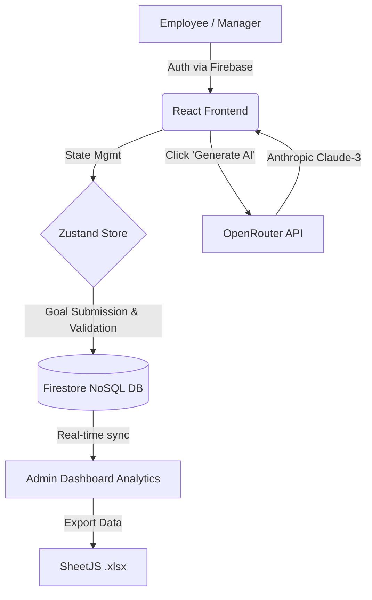

# 🏆 AtomQuest Hackathon 1.0 Submission: Enterprise Goal Tracker

## 1. Working Portal Link
👉 **[https://atomquest-portal.web.app](https://atomquest-portal.web.app)**

## 2. Source Code Repository
👉 **[https://github.com/deveshreddyp/atomquest-portal](https://github.com/deveshreddyp/atomquest-portal)**

---

## 3. Architecture Flow Diagram

---

## 🏗️ Technology Stack & Backend Approach
- **Frontend Layer:** React 18 with Vite for blazing-fast local development and HMR. We utilized **Tailwind CSS V4** and **Lucide React** to build a strict, monochromatic, "Enterprise-Grade" minimalist user interface that remains highly legible and performant. State is managed globally via **Zustand**, allowing seamless role-based routing (`/employee`, `/manager`, `/admin`).
- **Backend Infrastructure (BaaS):** We adopted a fully serverless approach using **Firebase**.
  - **Firebase Auth:** Handles secure session creation.
  - **Firestore Database (NoSQL):** Powers the core logic. We utilized *Firestore Batch Writes* (`writeBatch`) to ensure atomicity when submitting up to 8 goals at once. Global system states (e.g., active Quarterly Check-In phases) are handled via centralized Firestore documents to lock/unlock UI interactions in real-time.
  - **Firebase Hosting:** Provides a global CDN ensuring lightning-fast load times for the portal, with an automated CI/CD-style build script for updates.
- **Progressive Web App (PWA) Support:** Configured with a complete `manifest.json` and Apple web-app meta tags. The portal is fully installable as a standalone native app on mobile devices (iOS/Android), bypassing the browser URL bar for a truly immersive enterprise experience.
- **Enterprise Governance & Security:** Strict adherence to BRD requirements. The system calculates physical mathematical progress scores. Furthermore:
  - **Firebase Security Rules:** Implemented granular, Role-Based Access Control (RBAC) at the database layer. No "Test Mode" vulnerabilities.
  - **Immutable System Audit Logs:** Every critical action (roster allocations, goal approvals, AI usages) is strictly recorded in a tamper-proof timeline visible to Admins.
- **AI Integration (Employee & Manager):** Integrated **OpenRouter (Claude-3)** securely. Employees receive instant, AI-generated SMART goals. Managers can click "✨ AI Insight" to generate instant, professional performance summaries of their team members.
- **Enterprise Utilities:**
  - **PDF Export:** Employees can export their approved goal sheets directly to a print-ready PDF using `html2pdf.js`.
  - **Excel Export:** Admins can export system rosters using `SheetJS`.
- **Premium Polish:**
  - Official Atomberg brand styling and SVG iconography.
  - Replaced native browser alerts with animated `SweetAlert2` modals.
  - Persistent, system-wide **Dark Mode** toggle.
  - Interactive System Guide on the landing page with `fade-in` CSS micro-animations.

---

## 🔑 Test Credentials & Testing Flow
Please use the following credentials to evaluate the role-based dashboards:

| Role | Email | Password |
| :--- | :--- | :--- |
| **Admin** | `admin@test.com` | `AtomQuest2026!` |
| **Manager** | `manager@test.com` | `AtomQuest2026!` |
| **Employee** | `employee@test.com` | `AtomQuest2026!` |

*(Note: Ensure you test the dynamic "Roster Allocation" feature by creating a link between an employee and manager using the Admin Dashboard first!)*
