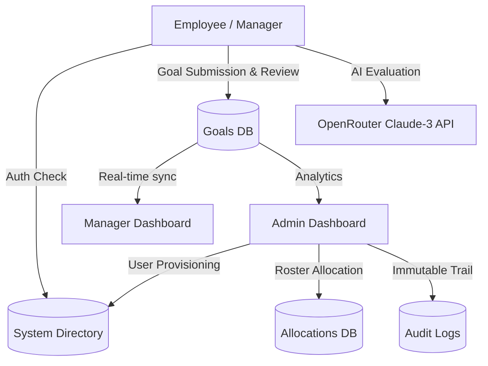

# 🏆 AtomQuest Hackathon 1.0 Submission: Enterprise Goal Tracker

## 1. Working Portal Link
👉 **[https://atomquest-portal.web.app](https://atomquest-portal.web.app)**

## 2. Source Code Repository
👉 **[https://github.com/deveshreddyp/atomquest-portal](https://github.com/deveshreddyp/atomquest-portal)**

---

## 3. Architecture Flow Diagram

---

## 🏗️ Technology Stack & Backend Approach
- **Frontend Layer:** Built on **React 18** with **Vite** for blazing-fast HMR. The UI is built entirely with **Tailwind CSS V4** and **Lucide React** to create a strict, monochromatic, "Enterprise-Grade" user interface. State routing is handled by **Zustand** for seamless Role-Based Access Control (`/employee`, `/manager`, `/admin`). Analytics visualizations powered by **Recharts**.
- **Backend Infrastructure (BaaS):** Fully serverless architecture powered by **Firebase**.
  - **Firebase Auth:** Handles secure user authentication sessions.
  - **Firestore Database (NoSQL):** Powers the core relational logic between Employees, Managers, and Goals. Implements *Firestore Batch Writes* (`writeBatch`) to ensure atomicity. **Firestore Security Rules** are deployed to strictly lock down sensitive collections (e.g., only Admins can read/write to `system_users`).
  - **Firebase Hosting:** Global CDN ensuring lightning-fast load times.

## 🚀 Key Hackathon Features & Strengths
1. **Identity & Roster Management:** Complete lifecycle management from the Admin Dashboard. Admins can provision new users, assign roles (Admin/Manager/Employee), and seamlessly link Employees to their respective Managers. Includes strict server-side validation to prevent self-allocations or assigning unregistered users.
2. **Immutable System Audit Logs:** Every critical action (roster allocations, allocation deletions, phase changes, goal approvals) is strictly recorded in a tamper-proof timeline visible only to the Admin, ensuring enterprise-level compliance and transparency.
3. **Manager-Employee Feedback Loop:** An interactive workflow where Managers can "Reject & Comment" on individual goals. Employees receive immediate alerts on their dashboard with the required changes and can resubmit their targets directly.
4. **AI Integration (Claude-3):** Deeply integrated OpenRouter API. Employees can generate SMART goals instantly. Managers can utilize "✨ AI Insight" to generate instant, professional performance summaries of their team members based on their targets and achievements.
5. **Push Shared KPIs:** Managers can create overarching departmental goals and force-push them onto the active goal sheets of their entire roster simultaneously.
6. **Enterprise Utilities:** 
   - **PDF Export:** Employees can export their approved goal sheets directly to a print-ready PDF using `html2pdf.js`.
   - **Excel Export:** Admins can export system rosters and goal data using `SheetJS`.
7. **Premium Atomberg Branding:** Official high-resolution transparent wordmarks, custom Favicons, Atomberg Yellow `#FDB913` core themes, and sleek micro-interactions built for a premium feel.

## ⚠️ Architecture Roadmap (Future Enterprise Scaling)
While the current portal is highly robust for an MVP, an enterprise-scale rollout would require the following architectural evolutions:
- **Zero-Trust Role Security:** Migrating role-verification from Firestore Documents to **Firebase Auth Custom Claims** (`admin: true`) via Cloud Functions to completely prevent frontend spoofing.
- **Backend Analytics Aggregation:** Currently, Admin Analytics fetch raw goal documents to render charts. At 10,000+ employees, this would hit Firestore read limits. Future state requires nightly scheduled Cloud Functions to aggregate data into a single `analytics_summary` document.
- **WebSocket Subscriptions:** Upgrading explicit `fetch()` requests on the Manager dashboard to `onSnapshot()` listeners for instantaneous, real-time sync across all active sessions.

---

## 🔑 Test Credentials & Testing Flow
Please use the following credentials to evaluate the role-based dashboards:

| Role | Email | Password |
| :--- | :--- | :--- |
| **Admin** | `admin@test.com` | `AtomQuest2026!` |
| **Manager** | `manager@test.com` | `AtomQuest2026!` |
| **Employee** | `employee@test.com` | `AtomQuest2026!` |

*(Note: Ensure you test the dynamic "Roster Allocation" feature by creating a link between an employee and manager using the Admin Dashboard first!)*
