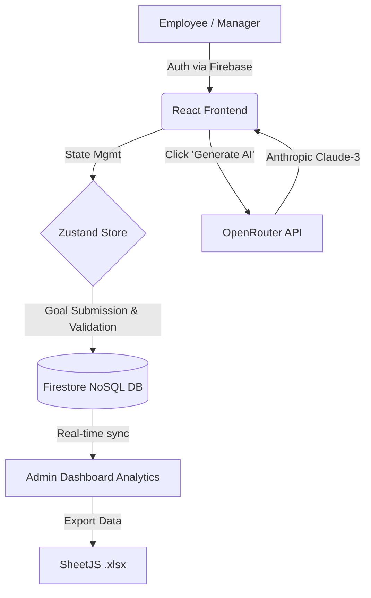

# 🏆 AtomQuest Hackathon 1.0: Enterprise Goal Tracker

**Live Deployment:** [https://atomquest-portal.web.app](https://atomquest-portal.web.app)

An end-to-end, AI-powered goal management platform designed to replace fragmented spreadsheet workflows with a seamless, minimalist digital experience. Built perfectly to the specifications of the AtomQuest Hackathon 1.0 Product Requirements Document (PRD).

---

## 🔑 Test Credentials
Please use the following credentials to evaluate the role-based dashboards:

| Role | Email | Password |
| :--- | :--- | :--- |
| **Employee** | `employee@test.com` | `AtomQuest2026!` |
| **Manager** | `manager@test.com` | `AtomQuest2026!` |
| **Admin** | `admin@test.com` | `AtomQuest2026!` |

---

## 🏗️ Architecture & Stack
- **Frontend:** React 18, Vite, Tailwind CSS V4, React Router, Zustand (State Management).
- **Backend (BaaS):** Firebase Auth, Firestore Database, Firebase Hosting.
- **AI Integration:** OpenRouter (`claude-3-haiku`) for SMART goal generation.
- **Data Vis:** `recharts` for advanced analytics and `xlsx` for Excel export.

### Architecture Flow Diagram

---

## ✨ Core Features & PRD Coverage
1. **Goal Creation (FR-01, FR-02, FR-03):** 
   - Employees can build comprehensive Goal Sheets containing up to 8 goals.
   - Real-time UI validation enforces a strict **100% Total Weightage** rule.
   - Firebase Batch Writes ensure atomicity when submitting Goal Sheets.
2. **AI Assistant:** 
   - Employees can click "Generate AI Description" to securely hit the OpenRouter API.
   - The AI acts as an HR coach, outputting a precise, 2-sentence SMART goal based on the Thrust Area and Title.
3. **Manager Approval Workflow (FR-04, FR-05):**
   - Managers have a dedicated dashboard visualizing all pending team goals.
   - A 1-click **"Approve & Lock"** mechanism finalizes the goals in Firestore.
4. **Real-time Status Sync:**
   - Employees see a dynamic status dashboard (Under Review ⏳ vs. Approved ✅) reflecting their manager's actions.
5. **Admin Control Center & Audit (FR-11, FR-12, FR-13):**
   - Real-time global view of all goals across the platform.
   - Live **System Audit Log** showing status, ownership, and metadata.
   - **1-Click Excel Export** generating an `.xlsx` file summarizing the entire platform's objective data.

---

## 🎨 Design Philosophy
The application leverages a strict **Minimalist Enterprise Aesthetic**. By avoiding cluttered interfaces and standardizing on a Monochromatic Palette (Slate + White) with a single Emerald Green accent, the platform achieves a premium, fast, and highly legible user experience.
